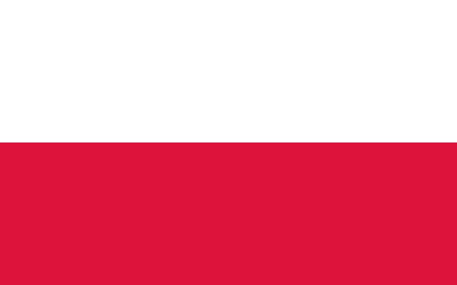
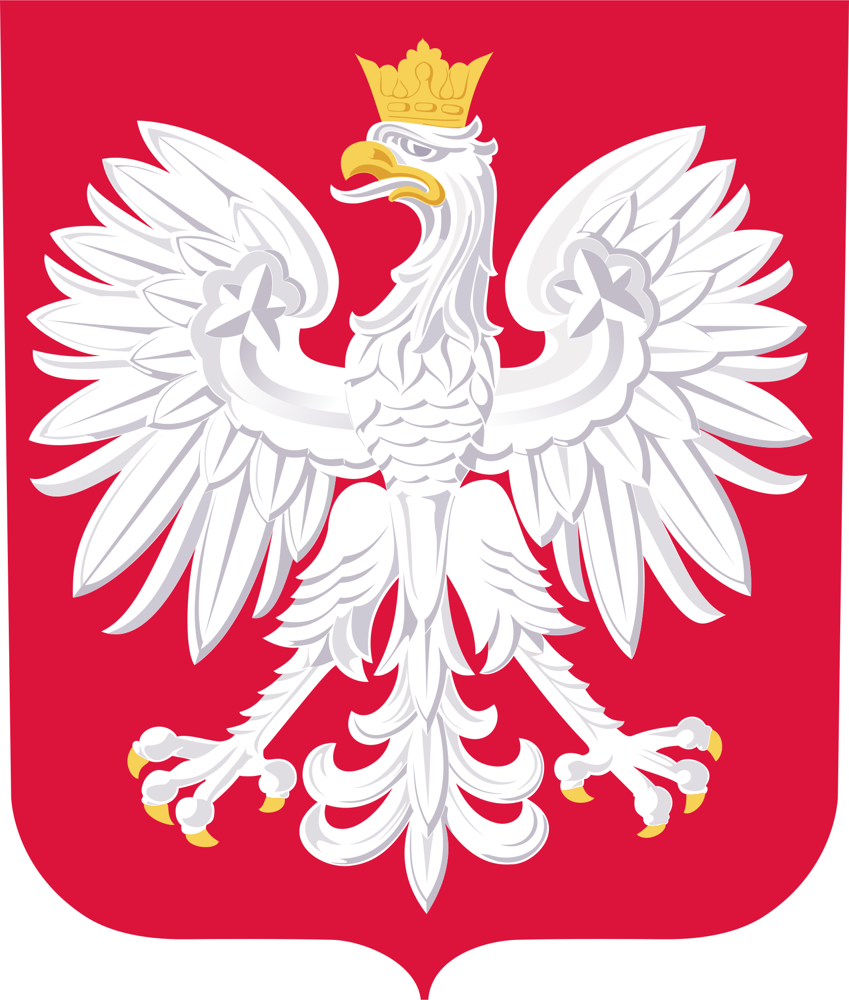

---
aliases:
  - Poland
  - Polonia
  - Pologne
  - بولندا
  - 波兰
  - Польша
  - the Republic of Poland
  - la República de Polonia
  - ReadMe
has_id_wikidata: Q36
title: Poland
linkTitle: ""
type: Country
SpocWebEntityId: 26996
location:
  - 52.0027
  - 17.6996
license: CC BY-SA 4.0
source: https://datahub.io/core/country-codes
isDeleted: false
isReadOnly: false
cssclasses:
  - Country
publish: true
keywords: ""
layout: ""
draft: false
confidential: public
publishDate: ""
expiryDate: ""
icon: flag-pl
tags:
  - geo/Country
Languages:
  - pl
dv_is_a_: "[[../../../../Geography/Place]]"
dv_has_place_longitude: 17.6996
dv_has_place_latitude: 52.0027
dv_has_name_: Poland
dv_has_name_en: Poland
dv_has_name_es: Polonia
dv_has_name_fr: Pologne
dv_has_name_cn: 波兰
dv_has_name_ar: بولندا
dv_has_name_ru: Польша
dv_has_name_de: Polen
dv_ISO2: PL
dv_ISO3: POL
dv_has_:
  name_:
  url_for_:
    code_repository: https://github.com/SpocWiki/Europe-Poland
  image_for_:
    flag: "![[./Flag_of_Poland.svg|200]] "
    coat_of_arms: "![[./Coat_of_Arms-Poland.svg|150]] "
  sound_of_:
    anthem: "![[Anthem-Poland.mp3]]"
dv_ISO4217-currency_alphabetic: PLN
dv_ISO4217-currency_name: Zloty
dv_ISO4217-currency_numeric: 985
dv_ISO4217-currency_minor_unit: 2
dv_ISO4217-currency_country_name: POLAND
dv_Telephone: 48
dv_Global: true
dv_Global_Name: World
dv_CLDR_display_name: Poland
dv_UNTERM_English: Poland
dv_UNTERM_English_Formal: the Republic of Poland
dv_UNTERM_Spanish_Formal: la República de Polonia
dv_UNTERM_Spanish: Polonia
dv_UNTERM_French: Pologne (la)
dv_UNTERM_Arabic: بولندا
dv_UNTERM_Arabic_Formal: جمهورية بولندا
dv_UNTERM_Chinese: 波兰
dv_UNTERM_Chinese_Formal: 波兰共和国
dv_UNTERM_French_Formal: la République de Pologne
dv_UNTERM_Russian: Польша
dv_UNTERM_Russian_Formal: Республика Польша
dv_Region_Name: "[[../../../Europe]]"
dv_Intermediate_Region_Name: "[[ReadMe]]"
dv_Sub-region_Name: "[[Eastern Europe]]"
dv_Region: 150
dv_Sub-region: 151
dv_Geoname-ID: 798544
dv_FIPS: PL
dv_FIFA: POL
dv_IOC: POL
dv_MARC: pl
dv_GAUL: 198
dv_WMO: PL
dv_ITU: POL
dv_DS: PL
dv_TLD: .pl
dv_EDGAR: R9
dv_M49: 616
dv_is_independent: Yes
dv_Developed_:
  Developing_Countries: Developed
dv_ISO3166-1-numeric: 616
dv_Area-Total: 312685
dv_Area-Land: 304220
dv_has_place_continent: "[[../../../Europe]]"
dv_VehicleCode: PL
dv_Capital: "[[Provinces~Poland/Masovian/counties~Mazowieckie/Warszawa]]"
dv_Alcohol-l: 13.3
dv_Language-Id: 494
dv_has_url_for_code_repository: https://github.com/SpocWiki/Europe-Poland
dv_has_image_for_flag: "![[./Flag_of_Poland.svg|200]] "
dv_has_image_for_coat_of_arms: "![[./Coat_of_Arms-Poland.svg|150]] "
dv_has_sound_of_anthem: "![[Anthem-Poland.mp3]]"
dv_developed_developing_countries: Developed
---

# [[Poland]] 

#is_a_/Place  
is_a_ = `=this.dv_is_a_`
has_place_longitude = `=this.dv_has_place_longitude` 
has_place_latitude = `=this.dv_has_place_latitude` 

## International Names

name = `=this.dv_name` 
has_name_en = `=this.dv_has_name_en` 
has_name_es = `=this.dv_has_name_es` 
has_name_fr = `=this.dv_has_name_fr` 
has_name_cn = `=this.dv_has_name_cn` 
has_name_ar = `=this.dv_has_name_ar` 
has_name_ru = `=this.dv_has_name_ru` 
has_name_de = `=this.dv_has_name_de` 

ISO2 = `=this.dv_ISO2` 
ISO3 = `=this.dv_ISO3` 

> [!info] This Article is only a Stub. 
For more Details, check out [this Git-Repository](https://github.com/SpocWiki/Europe-Poland)
into a Subfolder named `Poland`, so that this Link into the Sub-Repository works: [[Poland/ReadMe]] 

has_url_for_code_repository = `=this.dv_has_url_for_code_repository`

> [!warning] This can considerably increase the total size and depth of your wiki.


### #has_/image_for_/flag 

has_image_for_flag = `=this.dv_has_image_for_flag`

## #has_/text_of_/abstract  

> **Poland**, officially the Republic of Poland, is a country in Central Europe. It is divided into 16 administrative voivodeship provinces, covering an area of 312,696 km2 (120,733 sq mi). Poland has a population of over 38 million and is the fifth-most populous member state of the European Union. Warsaw is the nation's capital and largest metropolis. Other major cities include Kraków, Wrocław, Łódź, Poznań, and Gdańsk.
>
> Poland has a temperate transitional climate, and its territory traverses the Central European Plain, extending from the Baltic Sea in the north to the Sudetes and Carpathian Mountains in the south. The longest Polish river is the Vistula, and Poland's highest point is Mount Rysy, situated in the Tatra mountain range of the Carpathians. The country is bordered by Lithuania and Russia to the northeast, Belarus and Ukraine to the east, Slovakia and the Czech Republic to the south, and Germany to the west. It also shares maritime boundaries with Denmark and Sweden.
>
> Prehistoric human activity on Polish soil dates to the Lower Paleolithic, with continuous settlement since the end of the Last Glacial Period. Culturally diverse throughout late antiquity, in the early medieval period the region became inhabited by the tribal Polans, who gave Poland its name. The process of establishing proper statehood, which began in 966, coincided with the conversion of a pagan ruler of the Polans to Christianity, under the auspices of the Roman Catholic Church. The Kingdom of Poland emerged in 1025, and in 1569 cemented its long-standing association with Lithuania, thus forming the Polish–Lithuanian Commonwealth. At the time, the Commonwealth was one of the great powers of Europe, with a uniquely liberal political system which adopted Europe's first modern constitution in 1791.
>
> With the passing of the prosperous Polish Golden Age, the country was partitioned by neighbouring states at the end of the 18th century. Poland regained its independence in 1918 as the Second Polish Republic and successfully defended it in the Polish–Soviet War from 1919 to 1921. In September 1939, the invasion of Poland by Germany and the Soviet Union marked the beginning of World War II, which resulted in the Holocaust and millions of Polish casualties. Forced into the Eastern Bloc in the global Cold War, the Polish People's Republic was a founding signatory of the Warsaw Pact. Through the emergence and contributions of the Solidarity movement, the communist government was dissolved and Poland re-established itself as a democratic state in 1989.
>
> Poland is a parliamentary republic, with its bicameral legislature comprising the Sejm and the Senate. It is a developed market and a high-income economy. Considered a middle power, Poland has the sixth-largest economy in the European Union by GDP (nominal) and the fifth-largest by GDP (PPP). It provides a very high standard of living, safety, and economic freedom, as well as free university education and a universal health care system. The country has 17 UNESCO World Heritage Sites, 15 of which are cultural. Poland is a founding member state of the United Nations, as well as a member of the World Trade Organization, OECD, NATO, and the European Union (including the Schengen Area).
>
> [Wikipedia](https://en.wikipedia.org/wiki/Poland)

## Maps and Flags 


### #has_/image_for_/coat_of_arms 

has_image_for_coat_of_arms = `=this.dv_has_image_for_coat_of_arms`

has_sound_of_anthem = `=this.dv_has_sound_of_anthem`


### #has_/map  

```leaflet
id: Poland
zoomFeatures: true 
minZoom: 4 
maxZoom: 18
geojsonFolder: .//
markerFolder: .//
```

## Metadata 

ISO4217-currency_alphabetic = `=this.dv_ISO4217-currency_alphabetic` 
ISO4217-currency_name = `=this.dv_ISO4217-currency_name` 
ISO4217-currency_numeric = `=this.dv_ISO4217-currency_numeric` 
ISO4217-currency_minor_unit = `=this.dv_ISO4217-currency_minor_unit` 
ISO4217-currency_country_name = `=this.dv_ISO4217-currency_country_name` 

Telephone = `=this.dv_Telephone` 

Global = `=this.dv_Global` 
Global_Name = `=this.dv_Global_Name` 

CLDR_display_name = `=this.dv_CLDR_display_name` 

UNTERM_English = `=this.dv_UNTERM_English` 
UNTERM_English_Formal = `=this.dv_UNTERM_English_Formal` 
UNTERM_Spanish_Formal = `=this.dv_UNTERM_Spanish_Formal` 
UNTERM_Spanish = `=this.dv_UNTERM_Spanish` 
UNTERM_French = `=this.dv_UNTERM_French` 
UNTERM_Arabic = `=this.dv_UNTERM_Arabic` 
UNTERM_Arabic_Formal = `=this.dv_UNTERM_Arabic_Formal` 
UNTERM_Chinese = `=this.dv_UNTERM_Chinese` 
UNTERM_Chinese_Formal = `=this.dv_UNTERM_Chinese_Formal` 
UNTERM_French_Formal = `=this.dv_UNTERM_French_Formal` 
UNTERM_Russian = `=this.dv_UNTERM_Russian` 
UNTERM_Russian_Formal = `=this.dv_UNTERM_Russian_Formal` 

Region_Name = `=this.dv_Region_Name`
Intermediate_Region_Name = `=this.dv_Intermediate_Region_Name`
Sub-region_Name = `=this.dv_Sub-region_Name`

Region = `=this.dv_Region` 
[	Intermediate_Region = `=this.dv_Region`
Sub-region = `=this.dv_Sub-region` 

Geoname-ID = `=this.dv_Geoname-ID` 
FIPS = `=this.dv_FIPS` 
FIFA = `=this.dv_FIFA` 
IOC = `=this.dv_IOC` 
MARC = `=this.dv_MARC` 
GAUL = `=this.dv_GAUL` 
WMO = `=this.dv_WMO` 
ITU = `=this.dv_ITU` 
DS = `=this.dv_DS` 
TLD = `=this.dv_TLD` 
EDGAR = `=this.dv_EDGAR` 
M49 = `=this.dv_M49` 

is_independent = `=this.dv_is_independent` 
developed_developing_countries = `=this.dv_developed_developing_countries` 
[	Land_Locked_Developing_Countries	 ::  ] 
[	Least_Developed_Countries	 ::  ] 
[	Small_is_a_ = `=this.dv_is_a_`

ISO3166-1-numeric = `=this.dv_ISO3166-1-numeric` 


Area-Total = `=this.dv_Area-Total` 
Area-Land = `=this.dv_Area-Land` 
has_place_continent = `=this.dv_has_place_continent`
VehicleCode = `=this.dv_VehicleCode` 
Capital = `=this.dv_Capital`

Alcohol-l = `=this.dv_Alcohol-l` 
Language-Id = `=this.dv_Language-Id` 


## Confidential Links & Embeds: 

### #is_/same_as :: [[/_Standards/Earth/Continent/Europe/Europe~East/Poland/ReadMe|ReadMe]] 

### #is_/same_as :: [[/_public/Earth/Continent/Europe/Europe~East/Poland/ReadMe.public|ReadMe.public]] 

### #is_/same_as :: [[/_internal/Earth/Continent/Europe/Europe~East/Poland/ReadMe.internal|ReadMe.internal]] 

### #is_/same_as :: [[/_protect/Earth/Continent/Europe/Europe~East/Poland/ReadMe.protect|ReadMe.protect]] 

### #is_/same_as :: [[/_private/Earth/Continent/Europe/Europe~East/Poland/ReadMe.private|ReadMe.private]] 

### #is_/same_as :: [[/_personal/Earth/Continent/Europe/Europe~East/Poland/ReadMe.personal|ReadMe.personal]] 

### #is_/same_as :: [[/_secret/Earth/Continent/Europe/Europe~East/Poland/ReadMe.secret|ReadMe.secret]] 

